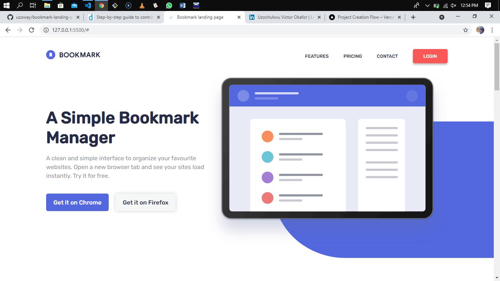

# Bookmark landing page

This is a solution to the [Bookmark landing page challenge on Frontend Mentor](https://www.frontendmentor.io/challenges/bookmark-landing-page-5d0b588a9edda32581d29158). Frontend Mentor challenges help you improve your coding skills by building realistic projects. 

## Table of contents

- [Overview](#overview)
  - [The challenge](#the-challenge)
  - [Screenshot](#screenshot)
  - [Links](#links)
- [My process](#my-process)
  - [Built with](#built-with)
  - [What I learned](#what-i-learned)
  - [Continued development](#continued-development)
- [Author](#author)

## Overview

### The challenge

Users should be able to:

- View the optimal layout for the site depending on their device's screen size
- See hover states for all interactive elements on the page
- Receive an error message when the newsletter form is submitted if:
  - The input field is empty
  - The email address is not formatted correctly

### Screenshot



### Links

- [Live site URL](https://bookmark-landing-page-jade.vercel.app/)
- [Solution URL](https://www.frontendmentor.io/solutions/responsive-bookmark-landing-page-built-using-html-css-and-javascript-sxztO_2Jo)

## My process

### Built with

- Semantic HTML5 markup
- CSS properties
- Flexbox
- JavaScript
- Desktop-first workflow

### What I learned

Completing this challenge has helped me improve my Frontend development skills such as:
- Responsive web design
- Writing semantic HTML5 markup
- Adding various web functionalities using JavaScript by manipulating the DOM

I've also been able to learn new things while completing the challenges, they include:
- Toggling a dropdown menu using vanilla javascript
- changing the color of an image using vanilla javascript
- Properly format a form using javascript

Below is a code snippet of how I was able to format the form:

```js
function validateForm() {
    let email = document.getElementById("email");
    let alert = document.getElementById("alert");
    let form = document.getElementById("formbox");
    let error = document.getElementById("img");

    let pattern = /^[a-zA-Z0-9.!#$%&'*+/=?^_`{|}~-]+@[a-zA-Z0-9]+(?:\.[a-zA-Z0-9-]+)*$/;  // Email address pattern

    if (email.value.match(pattern)){
        form.classList.add("valid");
        form.classList.remove("invalid");
        email.style.borderTop = "2px solid hsl(231, 69%, 60%)";
        email.style.borderLeft = "2px solid hsl(231, 69%, 60%)";
        email.style.borderRight = "2px solid hsl(231, 69%, 60%)";
        email.style.borderBottom = "25px solid hsl(231, 69%, 60%)";
        alert.innerHTML = " "; 
        error.style.opacity = "0";
        document.getElementById("formbox").reset(); // Resets form - input field after successful submission
        return true
    }

    else{
        form.classList.remove("valid");
        form.classList.add("invalid");
        email.style.borderTop = "2px solid hsl(0, 94%, 66%)"; 
        email.style.borderLeft = "2px solid hsl(0, 94%, 66%)";
        email.style.borderRight = "2px solid hsl(0, 94%, 66%)";
        email.style.borderBottom = "25px solid hsl(0, 94%, 66%)";
        alert.innerHTML = "Whoops, make sure it's an email";
        error.style.opacity = "1";
        return false
    }
}
```

```html
<form action="#" autocomplete="off" id="formbox" onsubmit="return validateForm()">
  <input type="text" required placeholder="Enter your email address" id="email" class="input">
  
  <button type="submit">Contact Us</button>
  <span id="alert"></span>
</form>
```

Below is the code snippet of how I was able to toggle the drop down menu onclick:

```js
const controls = document.getElementsByClassName("text");
const dropMenu = document.getElementsByClassName("drop-down-text");


controls[0].onclick = function(){
    if(dropMenu[0].style.display == "none"){
        dropMenu[0].style.display = "block";
    }
    else{
        dropMenu[0].style.display = "none";
    }
}

controls[1].onclick = function(){
    if(dropMenu[1].style.display == "none"){
        dropMenu[1].style.display = "block";
    }
    else{
        dropMenu[1].style.display = "none";
    }
}

controls[2].onclick = function(){
    if(dropMenu[2].style.display == "none"){
        dropMenu[2].style.display = "block";
    }
    else{
        dropMenu[2].style.display = "none";
    }
}

controls[3].onclick = function(){
    if(dropMenu[3].style.display == "none"){
        dropMenu[3].style.display = "block";
    }
    else{
        dropMenu[3].style.display = "none";
    }
```

### Continued development

For my next projects, I'll be focusing on learning how to implement animations on drop down menus and change of 
image onclick.

## Author

- LinkedIn - [Uzochukwu Victor Okafor](https://www.linkedin.com/in/uzochukwuokafor/)
- Frontend Mentor - [@uzoway](https://www.frontendmentor.io/profile/uzoway)

